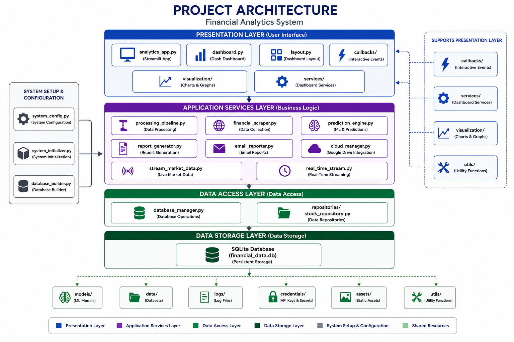
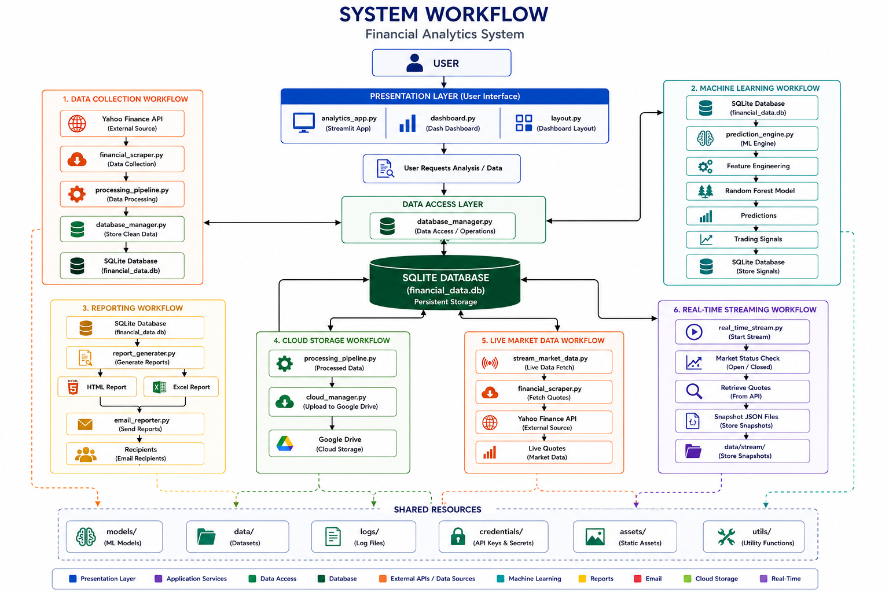
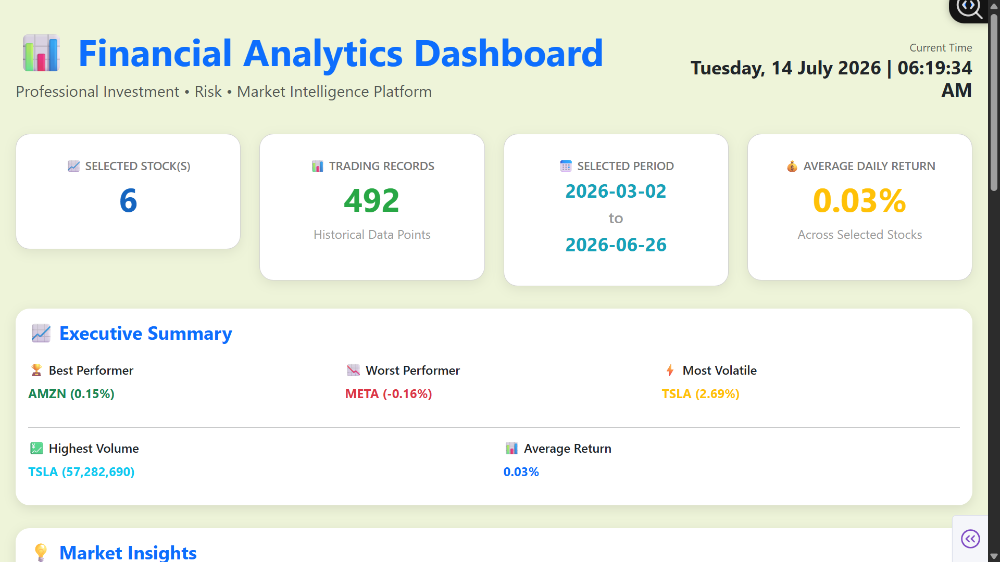
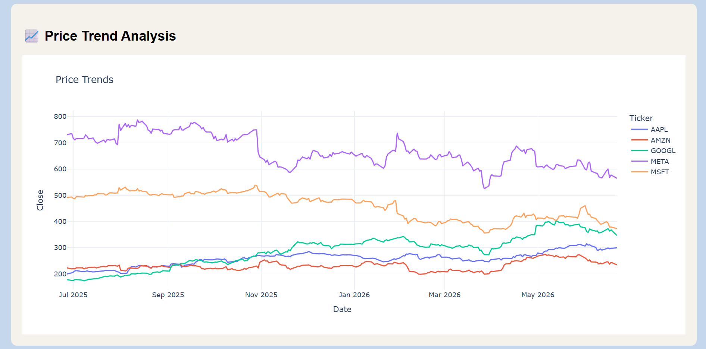
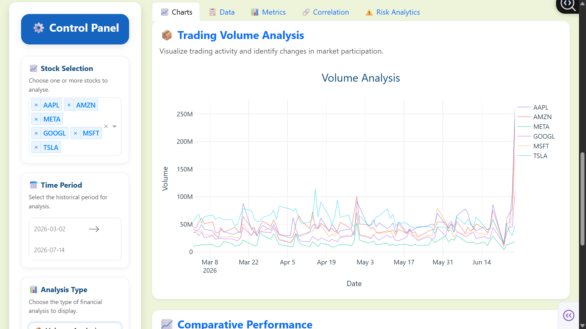
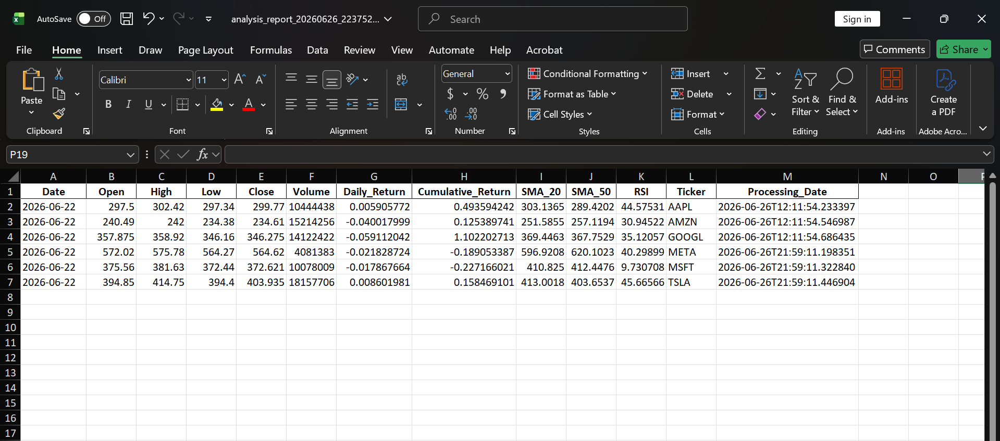
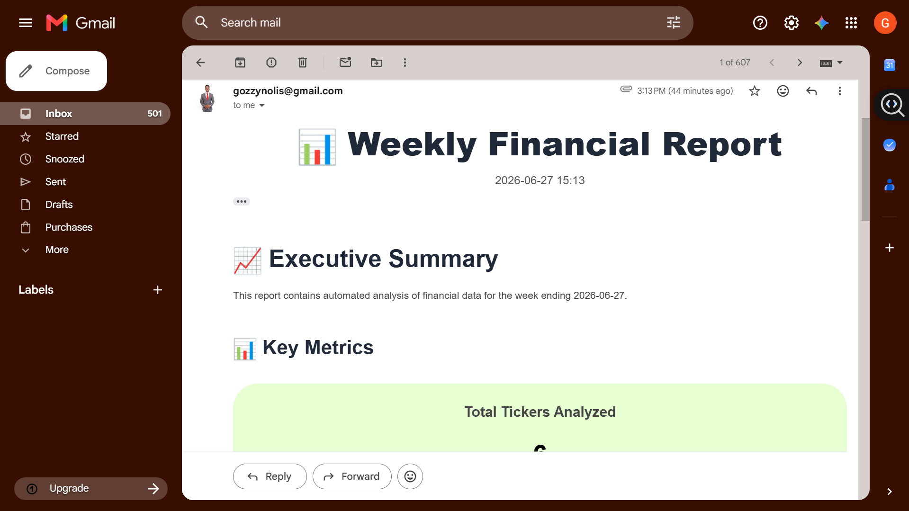
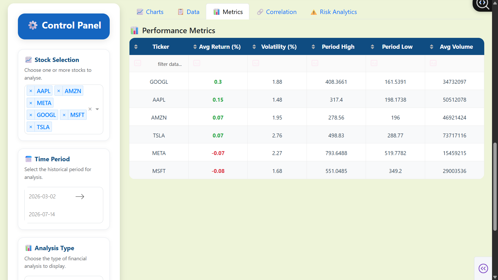

# Automated-Financial-Analytics-System

A comprehensive financial analytics platform that automates stock market data collection, ETL processing, machine learning-based price prediction, interactive dashboard visualization, automated reporting, Google Drive integration, and email-based report distribution.

The system combines data engineering, data analytics, machine learning, and business intelligence into a single end-to-end financial analysis workflow.


## Project Overview

The **Automated Financial Analytics System** is an end-to-end Python application designed to automate the collection, processing, analysis, visualization, and reporting of stock market data. It demonstrates how data engineering, machine learning, and business intelligence can be integrated into a single workflow for financial analysis.

The system extracts historical and live market data from financial data sources, processes the data through an ETL (Extract, Transform, Load) pipeline, stores the cleaned data in a SQLite database, and performs financial analysis using technical indicators and machine learning models. It then presents the results through interactive dashboards, automated reports, and email notifications.

The project includes two complementary dashboards:

* A **Streamlit dashboard** for simple, user-friendly exploration of financial data.

* A **Dash dashboard** for more advanced analytics, interactive visualizations, and portfolio insights.

To support automation, the application integrates with Google Drive for data storage and retrieval, generates Excel, CSV, and HTML reports, and can automatically distribute reports via email with file attachments.

The machine learning component uses a Random Forest regression model to forecast future stock prices, estimate expected returns, and generate basic trading signals such as **Buy**, **Hold**, and **Sell** based on predicted market movement.

Overall, this project demonstrates practical skills in:

* Data Engineering
* ETL Pipeline Development
* Financial Data Analysis
* Machine Learning
* Interactive Dashboard Development
* Data Visualization
* Database Design
* Reporting Automation
* Cloud Integration
* Python Application Development

## Key Features

* **Automated ETL Pipeline**

  * Extracts historical stock market data.
  * Cleans and transforms raw financial datasets.
  * Loads processed data into a SQLite database.

* **Historical & Live Market Data**

  * Retrieves one year of historical stock prices for machine learning.
  * Supports live market data retrieval and continuous streaming.

* **Financial Data Processing**

  * Calculates daily returns and cumulative returns.
  * Computes technical indicators including:

    * Simple Moving Average (SMA 20)
    * Simple Moving Average (SMA 50)
    * Relative Strength Index (RSI)

* **Machine Learning Price Prediction**

  * Trains a Random Forest Regression model.
  * Predicts future stock prices.
  * Calculates confidence intervals.
  * Generates expected returns.

* **Trading Signal Generation**

  * Produces automated trading recommendations:

    * Strong Buy
    * Buy
    * Hold
    * Sell
    * Strong Sell

* **Interactive Dashboards**

  * Streamlit dashboard for quick financial exploration.
  * Dash dashboard for advanced analytics and visualization.

* **Comprehensive Reporting**

  * Generates CSV reports.
  * Generates Excel reports.
  * Generates HTML reports.

* **Email Automation**

  * Creates professional HTML email reports.
  * Attaches generated reports automatically.
  * Supports multiple email recipients.

* **Google Drive Integration**

  * Downloads raw datasets.
  * Uploads processed datasets.
  * Synchronizes project data with Google Drive.

* **Database Management**

  * SQLite database with indexed tables.
  * Automated database initialization.
  * Prediction storage.
  * Financial metrics storage.

* **Live Data Streaming**

  * Periodically retrieves live market information.
  * Stores timestamped JSON snapshots.
  * Automatically removes outdated snapshots.

* **Modular Project Architecture**

  * Organized into services, repositories, callbacks, utilities, and visualization modules.
  * Designed for maintainability and future expansion.


## System Architecture

The Financial Analytics System follows a modular architecture that separates data collection, processing, analytics, visualization, reporting, and automation into independent components. This design improves maintainability, scalability, and code reusability.

### Architecture Overview



### Workflow

The system operates through the following stages:

1. **Data Collection**

   * The `financial_scraper.py` module retrieves historical and live market data from financial data sources.
   * Additional utilities such as `historical_import.py`, `market_data_loader.py`, and `stream_market_data.py` support bulk historical imports and real-time data retrieval.

2. **Data Processing**

   * The `processing_pipeline.py` module performs the Extract, Transform, and Load (ETL) process.
   * Raw datasets are cleaned, validated, enriched with technical indicators, and prepared for analysis.

3. **Database Management**

   * The processed data is stored in a SQLite database managed by `database_manager.py`.
   * The database stores stock prices, prediction results, and financial metrics.

4. **Machine Learning**

   * The `prediction_engine.py` module trains a Random Forest Regression model using historical stock prices.
   * The model predicts future closing prices, estimates expected returns, calculates confidence intervals, and generates trading signals.

5. **Analytics & Visualization**

   * The processed data is presented through two interactive dashboards:

     * **analytics_app.py (Streamlit)** for simple exploratory analysis.
     * **dashboard.py (Dash)** for advanced interactive analytics and visualization.

6. **Reporting**

   * The `report_generator.py` module produces professional CSV, Excel, and HTML reports summarizing financial performance and analytical insights.

7. **Automation**

   * The `email_reporter.py` module distributes reports automatically via HTML email with attachments.
   * The `cloud_manager.py` module synchronizes project files with Google Drive for cloud storage and retrieval.

8. **System Initialization**

   * The `system_initializer.py` module prepares the application environment, creates the database when necessary, and loads sample data if the database is empty.
   * The `launcher.py` module starts the complete analytics platform and launches both dashboards.

### System Workflow



The modular architecture allows each component to operate independently while remaining fully integrated into the overall analytics pipeline. This separation of responsibilities makes the system easier to maintain, extend, and test as additional data sources, machine learning models, or reporting capabilities are introduced.

## Project Structure

```text
Financial-Analytics-System/
│
├── analytics_app.py              # Streamlit analytics application
├── auth_validator.py             # Google Drive authentication validator
├── cloud_manager.py              # Google Drive integration
├── dashboard.py                  # Dash dashboard
├── database_builder.py           # Database schema creation
├── database_manager.py           # Database operations
├── email_reporter.py             # Automated email reporting
├── financial_scraper.py          # Financial data collection
├── historical_import.py          # Historical market data importer
├── launcher.py                   # Launches the complete system
├── prediction_engine.py          # Machine learning predictions
├── processing_pipeline.py        # ETL pipeline
├── report_generator.py           # Report generation
├── real_time_stream.py           # Continuous live data streaming
├── run_complete_system.py        # Runs both dashboards
├── stream_market_data.py         # Live market data retrieval
├── system_config.py              # Project configuration
├── system_initializer.py         # Database and system initialization
│
├── callbacks/
│   └── dashboard_callbacks.py
│
├── repositories/
│   └── stock_repository.py
│
├── services/
│   ├── analytics_service.py
│   └── data_service.py
│
├── utils/
│   ├── chart_style.py
│   └── logger.py
│
├── visualization/
│   └── charts.py
│
├── assets/
│   ├── project_architecture.png
│   ├── system_workflow.png
│   ├── dashboard_overview.png
│   ├── dashboard_chart_price.png
│   ├── dashboard_chart_vol.png
│   ├── email_report.png
│   └── style.css
│
├── credentials/
│   └── my_client_secret.json
│
├── data/
│   ├── raw/
│   ├── clean/
│   ├── live/
│   └── stream/
│
├── maintenance/
│   └── migrate_database.py
│
├── models/
│
├── .env
├── README.md
└── requirements.txt
```

## Technologies Used

The Financial Analytics System was developed using the following technologies and libraries:

### Programming Language

* Python 3.x

### Data Processing & Analysis

* Pandas
* NumPy

### Machine Learning

* Scikit-learn

  * Random Forest Regressor
  * StandardScaler

### Data Visualization

* Dash
* Plotly
* Streamlit

### Database

* SQLite

### Financial Data Sources

* yfinance

### Cloud Integration

* Google Drive API
* Google OAuth 2.0

### Reporting

* HTML
* CSV
* Microsoft Excel (XLSX)

### Email Automation

* SMTP (Gmail)
* Python `email` package

### Environment & Configuration

* python-dotenv

### Model Serialization

* Joblib

### Development Tools

* Visual Studio Code
* Git
* GitHub


## Installation & Setup

Follow the steps below to set up and run the Financial Analytics System on your local machine.

### 1. Clone the Repository

```bash
git clone https://github.com/gozzy15/Automated-Financial-Analytics-System.git
cd Automated-Financial-Analytics-System
```

---

### 2. Create a Virtual Environment (Recommended)

#### Windows

```bash
python -m venv venv
venv\Scripts\activate
```

#### macOS / Linux

```bash
python3 -m venv venv
source venv/bin/activate
```

---

### 3. Install the Required Dependencies

Install all required packages using:

```bash
pip install -r requirements.txt
```

---

### 4. Configure Environment Variables

Create a `.env` file in the project root.

Example:

```text
EMAIL_SENDER=your_email@gmail.com
EMAIL_PASSWORD=your_gmail_app_password
HR_EMAILS=recipient1@example.com,recipient2@example.com

GDRIVE_CREDENTIALS_PATH=credentials/my_client_secret.json
GDRIVE_FOLDER_ID=your_google_drive_folder_id

DB_PATH=financial_data.db

GROQ_API_KEY=your_api_key
```

#### Environment Variables

| Variable                  | Description                                                      |
| ------------------------- | ---------------------------------------------------------------- |
| `EMAIL_SENDER`            | Email address used for sending automated reports                 |
| `EMAIL_PASSWORD`          | Gmail App Password (recommended instead of your normal password) |
| `HR_EMAILS`               | Comma-separated list of report recipients                        |
| `GDRIVE_CREDENTIALS_PATH` | Path to the Google OAuth client credentials JSON file            |
| `GDRIVE_FOLDER_ID`        | Google Drive folder where project files are uploaded             |
| `DB_PATH`                 | SQLite database location                                         |
| `GROQ_API_KEY`            | Optional API key for future AI integrations                      |

---

### 5. Configure Google Drive

1. Create a Google Cloud project.
2. Enable the Google Drive API.
3. Create OAuth Desktop Application credentials.
4. Download the credentials JSON file.
5. Save the file inside the project's `credentials/` directory.
6. Update the `GDRIVE_CREDENTIALS_PATH` value in the `.env` file.

Example:

```text
credentials/
    my_client_secret.json
```

---

### 6. Initialize the System

Run the system initializer to create the database and populate it if necessary.

```bash
python system_initializer.py
```

This step will:

* Create the SQLite database.
* Create the required tables.
* Load sample data if the database is empty.
* Verify the database schema.

---

### 7. Launch the Complete Application

To start both analytics dashboards simultaneously, run:

```bash
python launcher.py
```

This launches:

* Streamlit Dashboard
* Dash Dashboard

The dashboards are available at:

* Streamlit: `http://localhost:8501`
* Dash: `http://localhost:8050`

---

### 8. Optional Utilities

Historical Market Data

```bash
python historical_import.py
```

Real-Time Market Data

```bash
python stream_market_data.py
```

Continuous Live Streaming

```bash
python real_time_stream.py
```

Google Drive Authentication Test

```bash
python auth_validator.py
```

---

### 9. Verify Installation

If everything has been configured correctly, you should be able to:

* Open both dashboards successfully.
* View historical stock data.
* Generate machine learning predictions.
* Produce analytical reports.
* Upload and download files from Google Drive.
* Send automated email reports.


## Usage

After completing the installation and setup, the Financial Analytics System can be used to collect, process, analyze, visualize, and report financial market data.

### Step 1 – Initialize the System

Before using the application for the first time, initialize the database and application environment:

```bash
python system_initializer.py
```

This creates the SQLite database, builds the required tables, and loads sample data if the database is empty.

---

### Step 2 – Import Historical Market Data

To train the machine learning model using real market data, import historical stock prices:

```bash
python historical_import.py
```

This downloads approximately one year of historical stock market data and stores it in the database.

---

### Step 3 – Launch the Analytics Dashboards

Start the complete application by running:

```bash
python launcher.py
```

This launches both dashboards simultaneously.

| Dashboard | URL                   | Purpose                                  |
| --------- | --------------------- | ---------------------------------------- |
| Streamlit | http://localhost:8501 | Lightweight analytics and quick insights |
| Dash      | http://localhost:8050 | Advanced interactive financial dashboard |

---

### Step 4 – Explore Financial Data

The dashboards allow users to:

* View historical stock prices.
* Analyze daily and cumulative returns.
* Explore trading volume.
* Monitor technical indicators such as:

  * SMA (20-day and 50-day)
  * RSI (Relative Strength Index)
* Compare multiple stocks over custom date ranges.

---

### Step 5 – Generate Machine Learning Predictions

The system uses a Random Forest Regression model to:

* Predict future closing prices.
* Estimate expected returns.
* Calculate confidence intervals.
* Generate automated trading signals such as:

  * Strong Buy
  * Buy
  * Hold
  * Sell
  * Strong Sell

Predictions are automatically stored in the database for future reference.

---

### Step 6 – Generate Reports

Generate comprehensive financial reports that include:

* Key financial metrics
* Machine learning predictions
* Trading signals
* Summary statistics

Reports are exported in multiple formats, including:

* HTML
* CSV
* Microsoft Excel (XLSX)

---

### Step 7 – Send Automated Email Reports

The email reporting module automatically:

* Creates an HTML financial report.
* Attaches generated reports.
* Sends the report to the configured recipients using SMTP.

---

### Step 8 – Synchronize with Google Drive

The cloud integration module enables the system to:

* Download raw datasets.
* Upload processed datasets.
* Synchronize generated reports.
* Manage project files stored in Google Drive.

---

### Step 9 – Retrieve Live Market Data (Optional)

Retrieve the latest available market data:

```bash
python stream_market_data.py
```

---

### Step 10 – Start Continuous Live Streaming (Optional)

Monitor the market continuously by running:

```bash
python real_time_stream.py
```

The live streaming service periodically retrieves market data and stores timestamped snapshots for later analysis.

---

### Typical Workflow

A typical end-to-end workflow is:

1. Initialize the system.
2. Import historical stock data.
3. Launch the dashboards.
4. Explore and analyze financial data.
5. Generate machine learning predictions.
6. Produce analytical reports.
7. Email reports to recipients.
8. Synchronize files with Google Drive.
9. Monitor live market data when required.


## Screenshots

The following screenshots illustrate some of the key components of the Financial Analytics System.

---

### Project Architecture

The overall architecture of the application showing the interaction between data collection, processing, storage, analytics, reporting, and visualization components.


---

### System Workflow

The end-to-end workflow illustrating how financial data flows through the system from extraction to reporting.


---

### Dashboard Overview

The primary analytics dashboard displaying key financial metrics and interactive visualizations.



---

### Stock Price Analysis

Interactive visualization of historical stock prices used for trend analysis.



---

### Volume Analysis

Trading volume visualization for monitoring market activity.



---

### Spreadsheet Report

Automatically generated Excel report containing processed financial data and summary metrics.



---

### Email Report

Automated HTML email report generated by the reporting module.



---

### Key Metrics Dashboard

Overview of the primary financial indicators calculated by the system.



---

### Prediction Table

Machine learning predictions and generated trading signals for monitored stocks.


## Future Improvements

The Financial Analytics System was designed with scalability in mind. Although the current implementation provides a complete end-to-end financial analytics workflow, several enhancements can be incorporated in future versions to improve functionality, performance, and user experience.

### Planned Enhancements

* Expand market coverage to include international stock exchanges and cryptocurrency markets.
* Integrate additional financial data providers for improved data reliability and redundancy.
* Support real-time streaming using WebSockets instead of periodic polling.
* Incorporate advanced machine learning models such as XGBoost, LightGBM, and Long Short-Term Memory (LSTM) neural networks for improved forecasting accuracy.
* Implement automated hyperparameter tuning and model performance comparison.
* Add portfolio optimization and risk management analytics based on Modern Portfolio Theory.
* Introduce sentiment analysis using financial news articles and social media data.
* Develop anomaly detection models for identifying unusual market behavior.
* Enhance the dashboard with additional interactive visualizations and customizable layouts.
* Provide user authentication and role-based access control for multi-user deployments.
* Containerize the application using Docker for simplified deployment.
* Deploy the platform to cloud services such as AWS, Microsoft Azure, or Google Cloud Platform.
* Build a REST API that allows external applications to consume financial data, analytics, and prediction services.
* Implement scheduled model retraining to continuously improve prediction quality as new market data becomes available.
* Add automated monitoring, alerting, and performance dashboards for production environments.

These enhancements would transform the project from a desktop analytics platform into a scalable enterprise-grade financial analytics solution suitable for larger datasets, multiple users, and production deployments.


## Acknowledgements

The development of this project was inspired by the need to automate financial data collection, analysis, visualization, and reporting within a unified analytics platform.

Special thanks to the following open-source projects and communities whose tools and resources made this project possible:

* **Yahoo Finance** and the **yfinance** library for providing accessible financial market data.
* **Scikit-learn** for machine learning algorithms and model evaluation tools.
* **Pandas** and **NumPy** for powerful data manipulation and numerical computing capabilities.
* **Plotly Dash** and **Streamlit** for interactive data visualization and dashboard development.
* **Google Drive API** for cloud-based file storage and synchronization.
* **Python Software Foundation** and the broader Python open-source community for maintaining the ecosystem that powers this project.

This project was developed as part of my continuous learning journey in Data Analytics, Data Engineering, and Machine Learning, with the goal of applying theoretical concepts to a practical, end-to-end financial analytics solution.


## Contact

If you have any questions, suggestions, or would like to discuss this project, feel free to get in touch.

**Chigozie Nnoli**

* GitHub: https://github.com/gozzy15
* LinkedIn: https://www.linkedin.com/in/chigozie-nnoli
* Email: [nnoligozie@gmail.com](mailto:nnoligozie@gmail.com)

I welcome feedback, collaboration opportunities, and discussions related to Data Analytics, Data Science, Machine Learning, Financial Analytics, and Python development.

If you found this project useful, consider giving the repository a ⭐ on GitHub.
